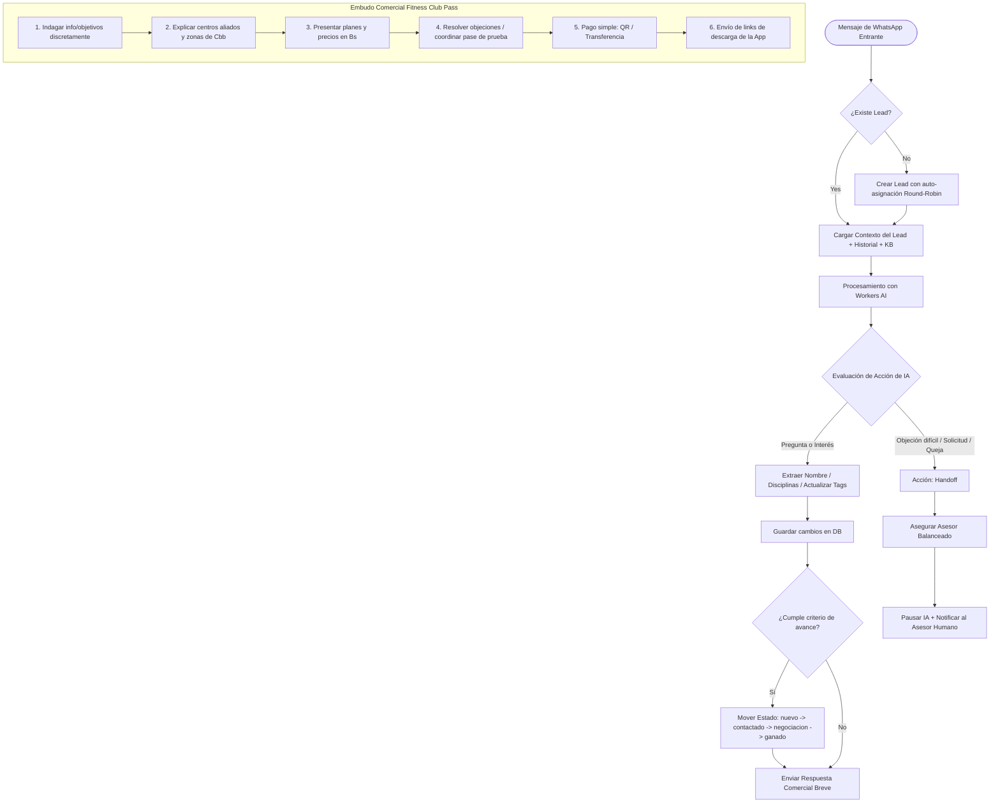

# Plan Integral de Mejoras y Evolución: Fitness CRM

> **Objetivo**: Planificar de manera detallada, estructurada y por fases todos los hallazgos y requerimientos detectados durante las pruebas exhaustivas del proyecto Fitness CRM (Fitness Club Pass en Cochabamba, Bolivia), sin ejecutar cambios destructivos hasta la validación y aprobación de cada fase.

---

## 1. Resumen Ejecutivo de Requerimientos

Durante el testing en equipo se identificaron puntos críticos en tres grandes áreas:
1. **Inteligencia Artificial y Flujo Comercial en WhatsApp**: Respuestas descontextualizadas o de evasión de IA (ej: *"no tengo acceso a información privada..."*), falta de extracción automática y progresiva de datos del cliente, necesidad de un embudo conversacional estructurado (información -> centros -> precios -> objeciones -> pago/QR -> link de app), actualización automática del estado/etiquetas/disciplinas de interés y handoff fluido hacia asesores humanos con balanceo de carga.
2. **Base de Datos y Rendimiento en Cloudflare D1**: Eliminación de la tabla `activity_logs` para evitar escrituras y lecturas excesivas; evaluación de la necesidad real de `whatsapp_settings` (sabiendo que tokens y IDs residen en variables de entorno); y optimización/limpieza de índices en SQLite/D1.
3. **Experiencia de Usuario Móvil (Responsiveness)**: Adaptabilidad total a pantallas de smartphones en Layout, Inbox de WhatsApp, Detalle de Prospectos y Formularios.
4. **Multimedia en WhatsApp**: Validación rigurosa de recepción y envío de imágenes con Meta Graph API v25.0 y almacenamiento permanente en Cloudflare R2.

---

## 2. Decisiones de Arquitectura y Respuestas a Puntos de Análisis

### A. Diagnóstico de la Tabla `whatsapp_settings`
- **Situación actual**:
  - Las credenciales de seguridad (`META_WA_PHONE_NUMBER_ID`, `META_WA_ACCESS_TOKEN`, `META_WA_VERIFY_TOKEN`, `META_APP_SECRET`) ya se leen prioritariamente de las variables de entorno (`.env` / Cloudflare Secrets).
  - La tabla `whatsapp_settings` actualmente guarda:
    1. El toggle global `ai_enabled` (1 o 0).
    2. El modelo de IA (`@cf/meta/llama-3.2-3b-instruct`).
    3. El tono (`ai_tone`) y las instrucciones comerciales editables (`ai_instructions`).
    4. El cache de visualización (`display_phone_number`, `verified_name`).
- **Dictamen**:
  - **No se debe eliminar por completo**, pero sí **simplificarla drásticamente**. Mantener las credenciales únicamente en variables de entorno (eliminando columnas viejas como `access_token_cipher`, `access_token_iv`, `waba_id`), y conservar en DB una tabla ligera `crm_settings` o `app_settings` para las configuraciones dinámicas de negocio que los administradores editan desde la pantalla (tono, prompt del negocio, toggle de IA y contexto del gimnasio) sin requerir redeploys.

### B. Eliminación de la Tabla `activity_logs`
- **Situación actual**: En cada mensaje entrante, cambio de estado, nota y asignación se hace un `INSERT INTO activity_logs`. La pantalla `Dashboard` y `LeadDetail` la consultan.
- **Dictamen**:
  - Se eliminará la tabla `activity_logs` de la base de datos y de las migraciones.
  - El historial conversacional ya vive en `whatsapp_messages` (con su propio timestamp, emisor, estado y tipo de mensaje).
  - Las notas del lead se consolidan en `leads.notes_summary` o una columna JSON ligera de notas.
  - Los cambios de estado y contacto se reflejan de forma nativa en `leads.status`, `leads.last_contacted_at` y `leads.last_inbound_at`.
  - El Dashboard se optimizará para mostrar métricas sin consultar logs redundantes, reduciendo el consumo de lecturas y escrituras en Cloudflare D1.

### C. Revisión y Optimización de Índices D1
- **Situación actual**: Hay índices existentes en `leads` y `whatsapp_messages`. Al eliminar `activity_logs`, se retira su índice `idx_activity_logs_lead_created`.
- **Nuevos índices propuestos**:
  - `idx_leads_phone_normalized` o mantener índice directo en `leads.phone` (UNIQUE implícito).
  - `idx_leads_status_assigned` compuesto en `leads(status, assigned_to)`.
  - `idx_whatsapp_lead_created` compuesto en `whatsapp_messages(lead_id, created_at DESC)` (fundamental para el historial del chat y el Inbox).
  - `idx_users_role_active` en `users(role, is_active)` para acelerar el balanceo round-robin.

---

## 3. Diagrama del Nuevo Flujo Conversacional de IA



---

## 4. Fases de Desarrollo Propuestas

### Fase 1: IA Comercial Experta, Embudo de Ventas y Extracción de Datos
1. **Rediseño del Prompt del Agente**:
   - Eliminar respuestas genéricas tipo asistente neutral ("No tengo acceso a datos privados..."). La IA asume el rol de asesor comercial de Fitness Club Pass Cochabamba en todo momento.
   - Forzar el flujo guiado:
     - *Etapa 1*: Saludo cálido y breve + pregunta discreta del nombre y disciplina preferida (gym, natación, crossfit, pádel).
     - *Etapa 2*: Explicación de sedes y centros aliados en Cochabamba (Cala Cala, América, Zona Central, etc.).
     - *Etapa 3*: Presentación de planes en Bolivianos (Bs 180 básico, Bs 280 pro, Bs 380 total black).
     - *Etapa 4*: Aclaración de dudas y objeciones comunes.
     - *Etapa 5*: Facilitar método de pago (QR simple / transferencia bancaria).
     - *Etapa 6*: Tras confirmación de pago, bienvenida y links de descarga de la aplicación móvil.
2. **Extensión del Schema de Acciones (`AgentActionSchema`)**:
   - Ampliar la salida estructurada de la IA para permitir actualizaciones en paralelo:
     ```typescript
     z.object({
       action: z.enum(['reply', 'update_and_reply', 'handoff']),
       reply_text: z.string().min(1),
       detected_name: z.string().optional(),
       detected_disciplines: z.array(z.string()).optional(),
       suggested_status: z.enum(['nuevo', 'contactado', 'negociacion', 'ganado', 'perdido']).optional(),
       suggested_tags: z.array(z.string()).optional(),
       image_url: z.string().url().optional(),
       handoff_reason: z.string().optional()
     })
     ```
3. **Persistencia Automática de Información**:
   - Si la IA detecta el nombre real del prospecto (cuando decía "WhatsApp 1234"), actualizar `leads.full_name`.
   - Vincular automáticamente disciplinas interesadas en `prospect_activities`.
   - Avanzar el estado (`leads.status`) de forma automática:
     - De `nuevo` a `contactado` en el primer intercambio de información.
     - A `negociacion` cuando consulta planes, cotizaciones o pide QR de pago.
     - A `ganado` cuando envía comprobante o confirma pago.

---

### Fase 2: Protocolo de Handoff a Humano y Asignación Balanceada
1. **Detección de Handoff**:
   - Disparadores automáticos:
     - El usuario pide explícitamente hablar con una persona ("hablar con asesor", "humano", "persona", "número del encargado").
     - Casos de quejas, inconvenientes con centros o consultas fuera del catálogo.
     - Errores de procesamiento o repeticiones circulares.
2. **Balanceo de Carga (Round-Robin Dinámico)**:
   - Asignar el lead al asesor activo con menor carga de leads abiertos (`status NOT IN ('ganado', 'perdido')`).
   - Si no tenía asesor asignado, ejecutar `autoAssignAgent` y marcar `handoff_at = DATETIME('now')`.
   - Notificación visual prominente en el inbox para que el asesor tome el control manual del chat.

---

### Fase 3: Optimización y Limpieza de Base de Datos (Cloudflare D1)
1. **Depuración de `activity_logs`**:
   - Eliminar `CREATE TABLE activity_logs` del esquema.
   - Eliminar todas las consultas `INSERT INTO activity_logs` en `src/routes/leads.ts`, `src/routes/whatsapp.ts`, `src/routes/activities.ts`, `src/routes/importExport.ts` y `src/lib/ai/salesAgent.ts`.
   - Adaptar `Dashboard.tsx` y `LeadDetail.tsx` para no depender de la bitácora antigua, mostrando el historial cronológico limpio a través de `whatsapp_messages` y el estado del lead.
2. **Simplificación de `whatsapp_settings`**:
   - Migrar la tabla a una estructura más limpia o mantener `whatsapp_settings` enfocada exclusivamente en la configuración de la IA (`ai_enabled`, `ai_model`, `ai_tone`, `ai_instructions`, `business_context`), eliminando campos muertos o redundantes de credenciales que ya están en `.env`.
   - Añadir en la interfaz de Ajustes el campo **"Contexto del Negocio"** para que los administradores puedan ajustar la propuesta de valor sin tocar código.
3. **Auditoría y Afinado de Índices**:
   - Depurar índices en D1 para optimizar las queries más frecuentes del Inbox y Leads, minimizando lecturas de filas en Cloudflare D1.

---

### Fase 4: Soporte y Validación de Imágenes en WhatsApp Cloud API v25.0
1. **Recepción de Imágenes**:
   - Validar el pipeline actual: Webhook Meta recibe `msg.type === 'image'` -> genera proxy `/api/whatsapp/media/:mediaId` -> descarga autenticada desde Meta Lookaside -> almacenamiento en R2.
   - Ajustar para que si el lead envía una foto (por ejemplo, comprobante de pago o captura del gimnasio), la IA reconozca que se recibió una imagen y actúe acorde (ej: felicitar y pedir datos para activar la app).
2. **Envío de Imágenes**:
   - Confirmar el endpoint `/api/upload/image` con subida a Cloudflare R2 y generación de URL pública HTTPS.
   - Validar que el cliente Meta (`sendMetaImageMessage`) despache correctamente la URL pública con caption hacia el teléfono del cliente.
   - Permitir que la IA también pueda adjuntar imágenes (por ejemplo, el código QR oficial de pago o el catálogo de sedes).

---

### Fase 5: Responsiveness Móvil y Adaptabilidad de la Interfaz
1. **Layout y Navegación Móvil**:
   - Ajustar la barra superior, el menú hamburguesa y el drawer lateral para pantallas < 640px.
2. **WhatsApp Live Inbox Mobile-First**:
   - En pantallas pequeñas, vista dividida tipo WhatsApp nativo: si hay conversación seleccionada, se muestra a pantalla completa el chat con botón superior "<- Volver a lista".
   - Ajustar el tamaño de burbujas, input bar y vista previa de adjuntos para teclados virtuales de smartphone.
3. **Expediente de Prospecto (LeadDetail)**:
   - Convertir la cuadrícula de 3 columnas en un flujo vertical apilado colapsable en móvil, asegurando que los selects de estado y coach sean cómodos de tocar en pantallas táctiles (mínimo 44px de target táctil).
4. **Dashboard y Listas**:
   - Ajustar tablas con scroll horizontal suave o cambio automático a vista de tarjetas (Cards) en pantallas pequeñas.

---

## 5. Matriz de Validación y Plan de Pruebas

| Requerimiento | Técnica de Verificación | Criterio de Éxito |
| :--- | :--- | :--- |
| **Flujo comercial IA** | Simulación de conversación paso a paso en test-runner y WhatsApp real. | La IA guía: Info -> Centros -> Precios en Bs -> Pago -> App. |
| **Extracción de datos** | Mensaje de prueba: *"Hola, me llamo Carlos y me interesa natación y gym"*. | `leads.full_name` se actualiza a "Carlos", actividades asociadas a Natación y Musculación. |
| **Avance de estado** | Lead consulta precios y pide QR. | `leads.status` cambia automáticamente a `negociacion`. |
| **Handoff a humano** | Mensaje: *"Quiero hablar con un asesor humano por favor"*. | IA responde amablemente, marca `handoff_at`, se pausa la IA y asigna agente por round-robin. |
| **Eliminación `activity_logs`** | Auditoría de código, suite de tests unitarios y build en Vite/Cloudflare. | Cero llamadas a `activity_logs`, reducción de writes/reads en D1, tests en verde. |
| **Imágenes WhatsApp** | Envío de comprobante desde WhatsApp y envío de QR desde CRM. | Imagen recibida se ve en Inbox; imagen enviada llega al celular vía Meta API v25.0. |
| **Responsiveness** | Emulación móvil en viewport 375x667 y 390x844 (iOS/Android). | Sin overflow horizontal, navegación fluida entre lista y chat, botones accesibles. |
